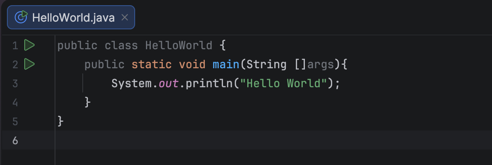
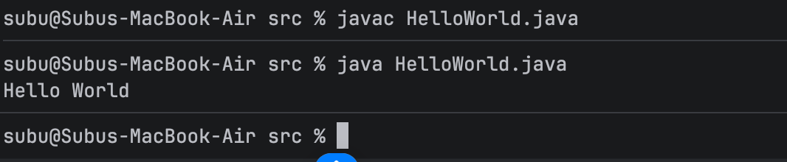

JDK Version used: 25.0.1

Hello world code run:

Java compiler compiles the helloWorld.java program

Command: javac HelloWorld.java

The compiled program is executed by the JVM.

Command: java HelloWorld

Hello World Java program

Run Steps
